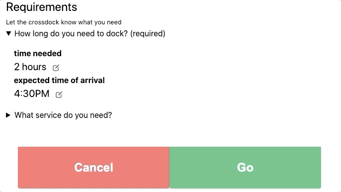

# CrossDock
[Live Website (https://crossdock.me)](https://crossdock.me)

**⭐ 2nd place winner in the GS1 Supply Chain Hackathon in 2020 ($9,000 Prize) ⭐**

## About
Steve and I built CrossDock over two weeks for the [GS-1 Flexible and Resilient: Future Proofing the Supply Chain Hackathon](https://gs1us-futureproofhack-platform.bemyapp.com/)

CrossDock addresses Challenge Statement #2 - Consumer Packaged Goods (CPG)
When the pandemic reached the United States, sales of consumer packaged goods (CPG) such as hand sanitizers and paper goods skyrocketed and became scarce commodities.

CrossDock provides a platform to handle shipments that are refused by the customer 
When a freight shipment is refused by the customer, the entire load is usually returned to the shipper. This propogates through the supply chain causing shortages and supply/demand issues such as supply shortages (out-of-stocks) experienced in early 2020. 

[Stephen Schlecht](https://www.linkedin.com/in/stephenschlecht/) Provided key business insights from his experience as a supply chain manager and marketed the product.

[Reid Sherman](https://www.linkedin.com/in/reidsherman/) Designed the product and built the web application.  

[Started September 5th, 2020](https://github.com/reidjs/crossdock/commit/6a3fa4a1b4d66fa3dd32a2a3086792e75e9fd3b3)

## How it Works

CrossDock connects people who ship products with warehouses and docks to resolve issues during transit with ad-hoc solutions.

_Trucks Drivers and Dispatchers_
The Shipper providers information about what service they need and their time requirements

We route the shipper to a nearby crossdock to rework their load

_Warehouse Workers and Managers_
The warehouse worker scans the GS1 Bill of Lading barcode

They then update the BOL inventory and send the updated data back to the shipper

<!--  Working GS-1 Barcode Reader -->

## Long Term Goals

Our initial niche is freight refusals by the customer due to shifted pallets, broken merchandise, etc. With a large enough network of crossdocks we envision our platform can handle things like:
- overweight/underweight loads
- roadside issues & mechanical problems
- 
And a multitude of other issues that arrive mid-transit. 

## Development

Put firebase.js file in src/ with config info

Put .env file with stripe information in root

`yarn install`  
`npm start`  
Requires crossdock-server running (separate repo) for payment processing.

## Deployment
Build site and rsync to server:  
`npm run deploy`

## Dependencies
React  
*Web Framework*

Gatsby  
*Server side renderer*  

TailwindCSS  
*Design Library*

Node.JS with Express  
*Server language*

NGINX  
*Web Server and Reverse Proxy*

Stripe  
*Payment Processor*

Leaflet and OpenStreetMaps  
*Mapping Library*

### TODO
- warehouse-dashboard
  - fix glitchy edit BOL table
  - back/forward button browser history
  - remove react-webcam stuff

- header
  - search
    - should open drawer that has quick links to 
      - account page > /account
      - find warehouse > find warehouse
      - find dock > find warehouse
      - payment info > acct page
      - support > /resources

- login page
  - add facebook/etc login

- logout button
  - sometimes glitchy with google logout

- index
  - blog links should actually link somehwere

find-warehouse page
- Login information should show up on the first step
- locations should show up on map & link to directions through google/apple maps
- enable back/forward button functionality 
- websockets to handle switchboard functionality
  - push info 
  - backend UI to see all websocket connections and user info 
